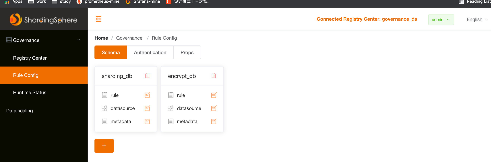
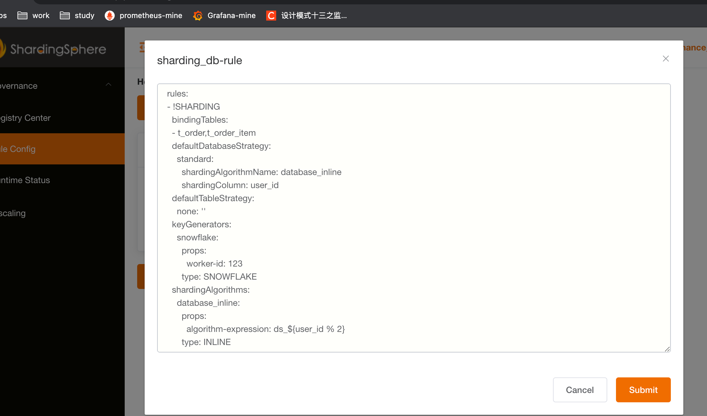

# Sharding-UI

> proxy 5.0.0-alpha jdk 1.8 (用11到处有问题)

## 环境准备

安装 ZK
```yaml
docker run -d -e TZ="Asia/Shanghai" -p 2181:2181 -v $PWD/data:/data --name zookeeper --restart always zookeeper
```
ShardingSphereProxy 启用zookeeper

```yaml
governance:
  name: governance_ds
  registryCenter:
    type: ZooKeeper
    serverLists: 127.0.0.1:2181
    props:
      retryIntervalMilliseconds: 500
      timeToLiveSeconds: 60
      maxRetries: 3
      operationTimeoutMilliseconds: 500
  overwrite: false
```

启动 Sharding-ui</p>

坑：https://github.com/apache/shardingsphere-ui/issues/84
只能使用 jdk1.8 启动，否则在登陆时会报序列化失败，就是上面这个问题


登陆到 shardingSphere-ui
配置：


配置规则

